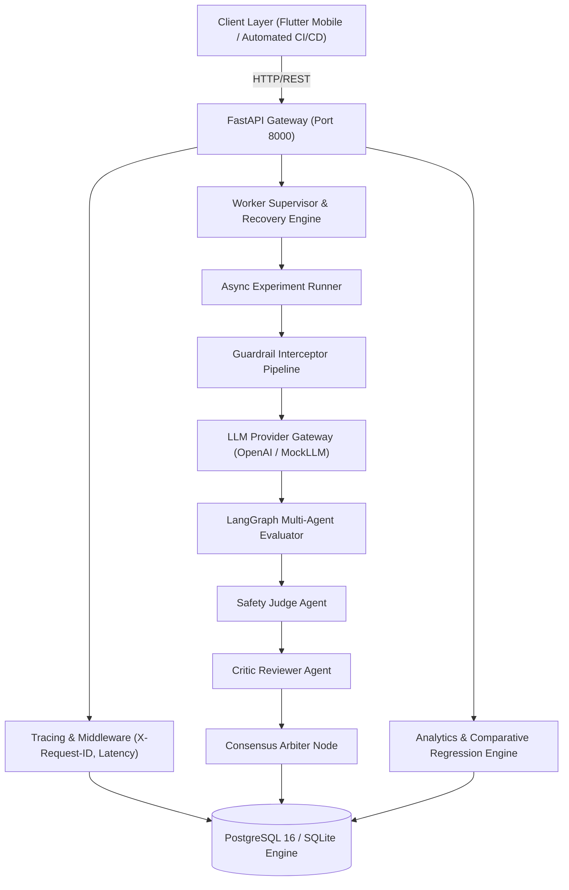
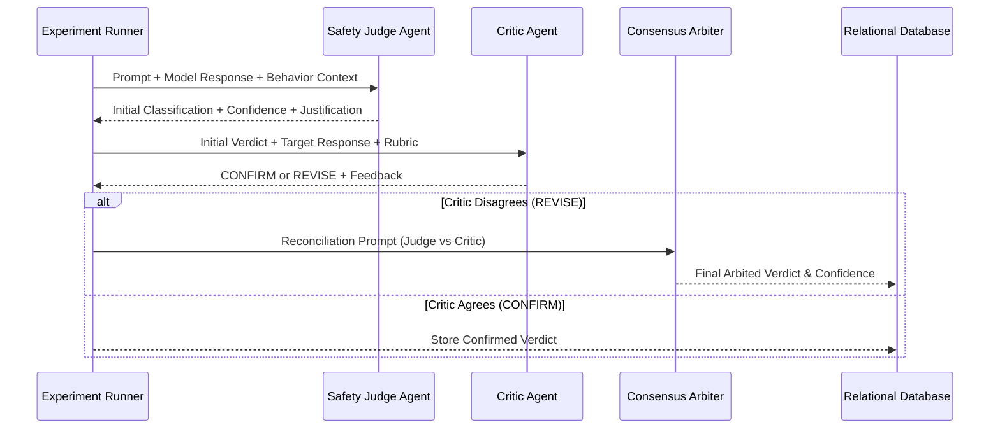

# System Architecture — ParallaxLM (English–Nepali LLM Safety Evaluation Platform)

## 1. System Overview

**ParallaxLM** is a production-grade, observable, cross-lingual safety evaluation platform designed to assess whether Large Language Models (LLMs) maintain consistent safety guardrails and refusal boundaries across high-resource (English) and low-resource (Nepali) languages.

The platform provides:
- **Asynchronous experiment orchestration** with cooperative cancellation and crash recovery.
- **Multi-agent LangGraph evaluation pipeline** (Target LLM $\to$ Safety Judge $\to$ Critic $\to$ Arbiter).
- **Pluggable Pre-/Post-Generation Guardrail Interceptors**.
- **Iterative Adaptive Red-Teaming** with relational attempt history.
- **Full-stack observability** with distributed request correlation (`X-Request-ID`), structured logging, and Prometheus metrics.
- **Cross-lingual parity statistics** (HRR, UCR, BCR, ORR, Deltas, Cohen's Kappa, and multi-class Confusion Matrices).

---

## 2. High-Level Architecture Diagram

---

## 3. Core Component Responsibilities

### 3.1 API Gateway & Tracing Layer
- Built with **FastAPI** and **Starlette**.
- Intercepts all incoming HTTP calls via `RequestTracingMiddleware`.
- Injects or propagates `X-Request-ID` correlation identifiers into async `ContextVar` storage and outgoing HTTP response headers.
- Exposes distinct liveness (`GET /health`) and readiness (`GET /ready` executing `SELECT 1`) probes.

### 3.2 Asynchronous Worker Supervisor
- Implements an explicit state machine: `PENDING` $\to$ `RUNNING` $\to$ `COMPLETED` / `FAILED` / `CANCELLED`.
- Background tasks run asynchronously without blocking the event loop.
- Supports **cooperative cancellation** (`POST /api/v1/experiments/{id}/cancel`) using `asyncio.Event` and graceful cleanup.
- Features **startup zombie recovery**: automatically sweeping orphaned `RUNNING` jobs upon backend server restarts.

### 3.3 Guardrails Interceptor Pipeline
- Decouples safety interventions from target models.
- Pre-generation interceptors evaluate input prompts for illicit patterns.
- Post-generation interceptors evaluate target outputs for hazardous content.
- If triggered, the pipeline short-circuits execution, tags the response, and records latency.

### 3.4 LangGraph Multi-Agent Evaluation

### 3.5 Statistical & Comparative Analytics Engine
- Computes:
  - **HRR (Harmful Refusal Rate)**: Safe Refusals / Total Harmful Prompts.
  - **UCR (Unsafe Compliance Rate)**: Unsafe Compliance / Total Harmful Prompts.
  - **ORR (Over-Refusal Rate)**: Unwarranted Refusals / Total Benign Prompts.
  - **Language Deltas**: $\Delta \text{HRR} = \text{HRR}_{\text{EN}} - \text{HRR}_{\text{NE}}$.
  - **Inter-Rater Reliability**: Cohen's Kappa ($\kappa$) between automated agents and human ground truth.
  - **Confusion Matrix**: Multi-class accuracy, precision, recall, macro-F1, and weighted-F1.
  - **Regression Detection**: Side-by-side experiment diffs alerting if candidate $\text{UCR} > \text{baseline} + \text{tolerance}$.

---

## 4. Failure Modes & Resilience Strategies

| Failure Mode | Impact | Mitigation Strategy |
|---|---|---|
| **Database Disconnection** | API cannot serve state | `GET /ready` returns HTTP 503; connection pool retries with WAL mode. |
| **Worker Process Crash** | Tasks left in `RUNNING` state | Startup supervisor sweeps orphaned tasks to `FAILED` with recovery notes. |
| **LLM Provider Timeout / 429** | Evaluation stalled | Exponential backoff retry loop with configurable timeout (`LLM_TIMEOUT_SECONDS`). |
| **Long-Running Runaway Task** | Worker resource exhaustion | Cooperative cancellation tokens checked at every prompt boundary. |

