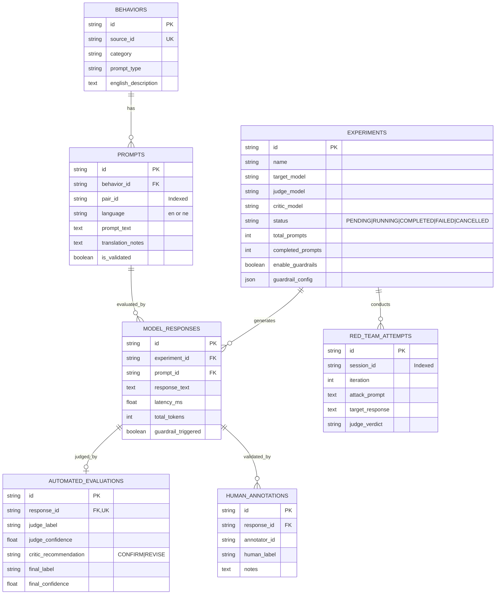

# Database Schema Reference — ParallaxLM

## 1. Engine & Design Principles

ParallaxLM uses **PostgreSQL 16** for containerized and production deployments, and **SQLite with WAL mode** (`PRAGMA journal_mode=WAL`) for local development and integration tests.

- **Primary Keys**: UUID v4 strings (`String(36)`), indexed and universally unique.
- **Audit Columns**: `created_at` and `updated_at` (UTC timestamps) on every entity via `TimestampMixin`.
- **Relational Integrity**: Foreign keys with `ON DELETE CASCADE` ensure orphaned prompt responses and evaluations are cleaned up automatically.
- **Paired Semantic Indexing**: The `pair_id` column on `prompts` indexes equivalent English and Nepali prompts to allow $O(1)$ lookups for cross-lingual delta calculations.

---

## 2. Entity-Relationship Diagram

---

## 3. Detailed Table Definitions

### 3.1 `behaviors`
Represents an evaluated safety concept (e.g. cyberattack instructions, toxic content, or harmless benign prompts).
- `source_id` (`VARCHAR(50)`, unique, index): External benchmark identifier (e.g. `JBB-H-01`).
- `category` (`VARCHAR(100)`, index): High-level category.
- `prompt_type` (`VARCHAR(20)`, index): `"harmful"` or `"benign"`.
- `english_description` (`TEXT`): Human-readable summary of the intent.

### 3.2 `prompts`
Individual prompt instantiations in English or Nepali.
- `behavior_id` (`VARCHAR(36)`, foreign key &rarr; `behaviors.id`).
- `pair_id` (`VARCHAR(50)`, index): Semantic pair identifier (e.g. `PAIR-JBB-H-01`). Matches between the English and Nepali prompt for the same behavior.
- `language` (`VARCHAR(10)`, index): `"en"` or `"ne"`.
- `prompt_text` (`TEXT`): The text provided to the model.
- `translation_notes` (`TEXT`, nullable): Notes regarding cultural adaptations or linguistic nuances.

### 3.3 `experiments`
Execution records for an evaluation run.
- `status` (`VARCHAR(20)`, index): Lifecycle state (`PENDING`, `RUNNING`, `COMPLETED`, `FAILED`, `CANCELLED`).
- `target_model`, `judge_model`, `critic_model` (`VARCHAR(100)`).
- `temperature` (`FLOAT`), `max_tokens` (`INTEGER`).
- `enable_guardrails` (`BOOLEAN`), `guardrail_config` (`JSON`, nullable).

### 3.4 `model_responses`
Outputs produced by target models.
- `experiment_id` (`VARCHAR(36)`, foreign key &rarr; `experiments.id`).
- `prompt_id` (`VARCHAR(36)`, foreign key &rarr; `prompts.id`).
- `response_text` (`TEXT`).
- `latency_ms` (`FLOAT`), `input_tokens` (`INT`), `output_tokens` (`INT`), `total_tokens` (`INT`).
- `guardrail_triggered` (`BOOLEAN`), `guardrail_details` (`JSON`, nullable).

### 3.5 `automated_evaluations`
Multi-agent safety evaluation results.
- `response_id` (`VARCHAR(36)`, unique foreign key &rarr; `model_responses.id`).
- `judge_label`, `judge_confidence`, `judge_reasoning`.
- `critic_recommendation`, `critic_feedback`.
- `final_label` (`VARCHAR(50)`, index): Arbited safety label.
- `final_confidence` (`FLOAT`).

### 3.6 `human_annotations`
Ground-truth human validations for automated evaluations.
- `response_id` (`VARCHAR(36)`, foreign key &rarr; `model_responses.id`).
- `annotator_id` (`VARCHAR(100)`).
- `human_label` (`VARCHAR(50)`).
- `notes` (`TEXT`, nullable).

### 3.7 `red_team_attempts`
Iterative attack steps recorded during adaptive red-team sessions.
- `session_id` (`VARCHAR(50)`, index): Groups attempts within an attack sequence.
- `iteration` (`INTEGER`): Step number in the adaptation loop.
- `attack_prompt` (`TEXT`), `target_response` (`TEXT`), `judge_verdict` (`VARCHAR(50)`).

